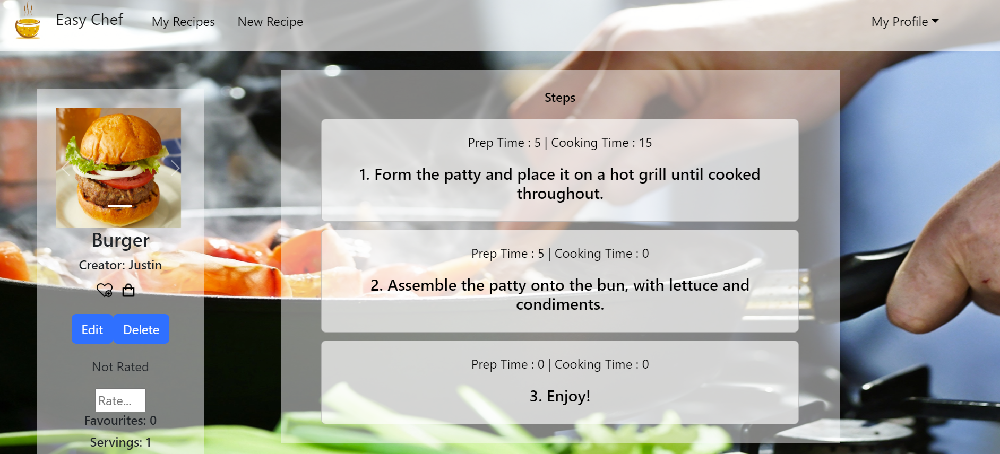
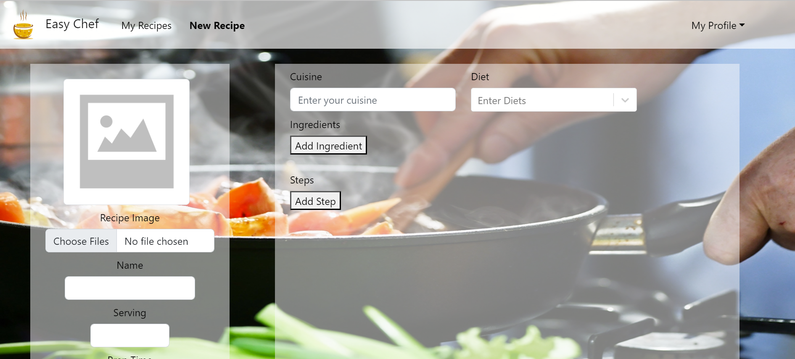
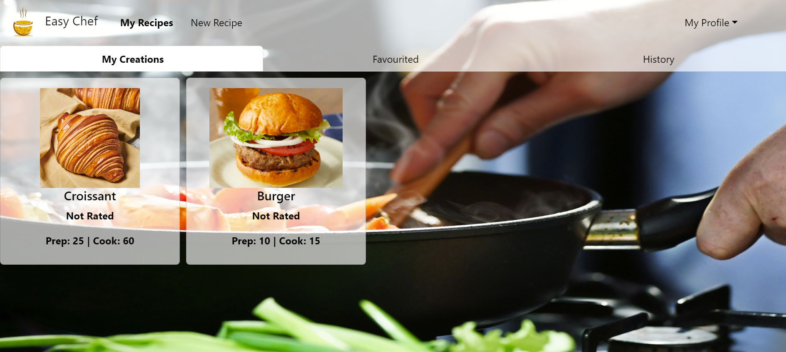
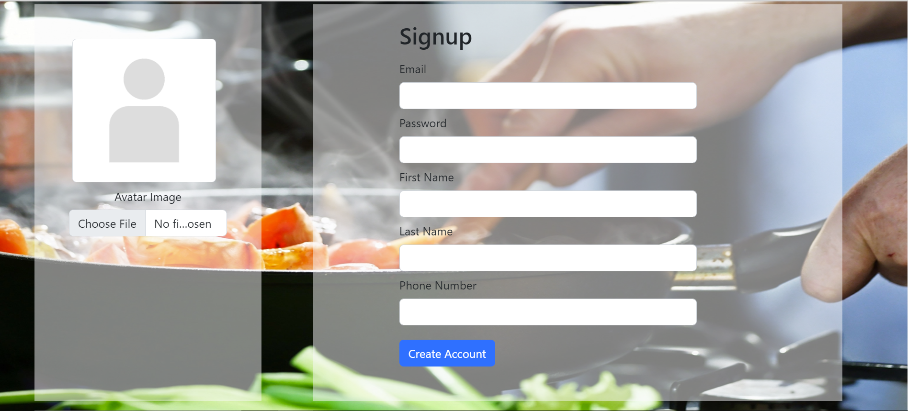

# Easychef
A recipe sharing social media site.
 
 Alongside images of recipes, users can include information such as diet, ingredients, prep time, cook time and steps. Users are able to rate recipes as well as see the number of favourites.
 
 
 Users are able to favourite recipes, as well as add them to their shopping list, which compiles all ingredients needed to cook recipes on the list. Viewed recipes are also autmatically added to the users history.
 
 The site also includes a full register, login and logout system.
 

